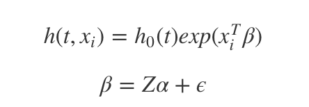
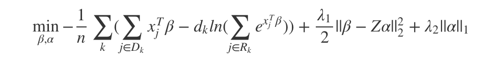

<!-- README.md is generated from README.Rmd. Please edit that file -->

```{r, echo = FALSE}
knitr::opts_chunk$set(
  collapse = TRUE,
  comment = "#>",
  fig.path = 'figures/'
)
```

#### This is development repository of `xrnet` package (https://github.com/USCbiostats/xrnet), __survival module__. 

The program is the prototype of regularized Cox's proportional hazard hierachical model to incorporate external information. `y=(t, \delta)` is survival outcome, `X` is the conventional design matrix, having dimension `n by p`. `Z` is external data matrix, with dimension `p by q`. In genomics study setting, it could be gene annotation data, which is featrues of the features in $X$. Modelling the two levels of data matrix with hierachical setting;

 

where `\beta` is the coefficients for first level features, and `\alpha` is the coefficients for second level external features.

Then, integrate two levels of models into one objective function:

 

The first component of the objective function is negative log Breslow's likelihood modeling 1st level information. The second component, `L2` norm of 2nd level information is to fit linear regression of external features on the coefficients of 1st level features. The third component is LASSO regularization on external feature coefficients `\alpha`, to do external feature selection. 

The algorithm uses proximal Newton algorithm and cyclic coordinate descent to optimize.

The `Rcpp` adpated Cpp function (to import to `R`), `cdlcoxRcpp()` is to fit the mdoel.
